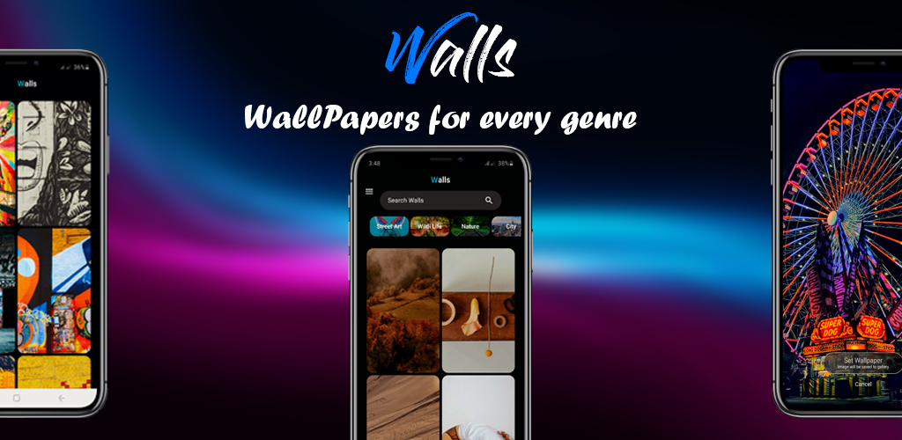
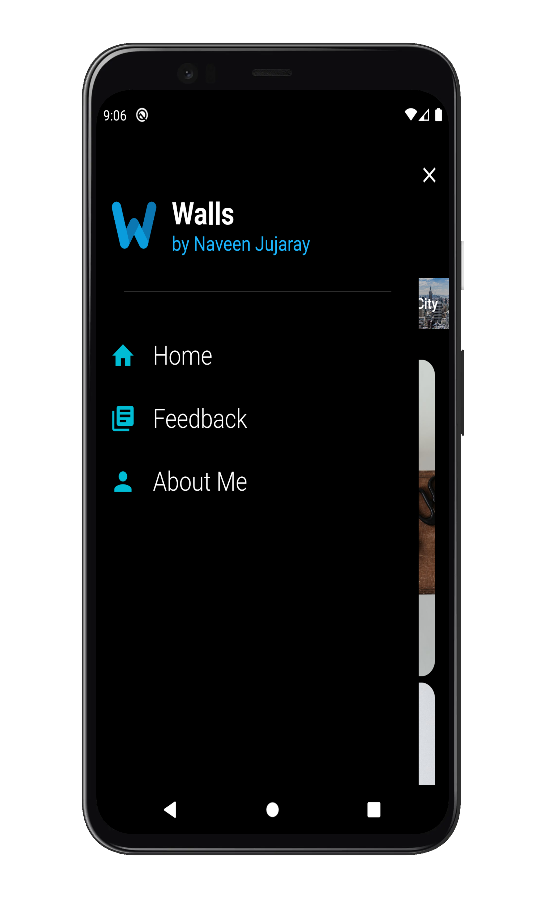
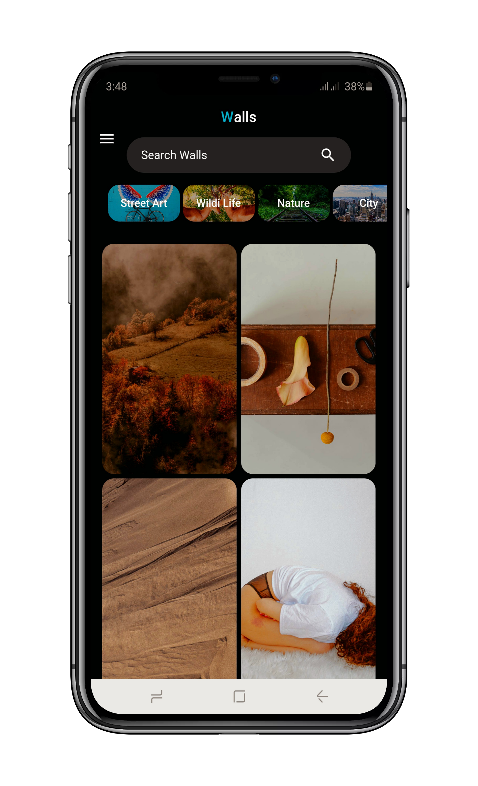
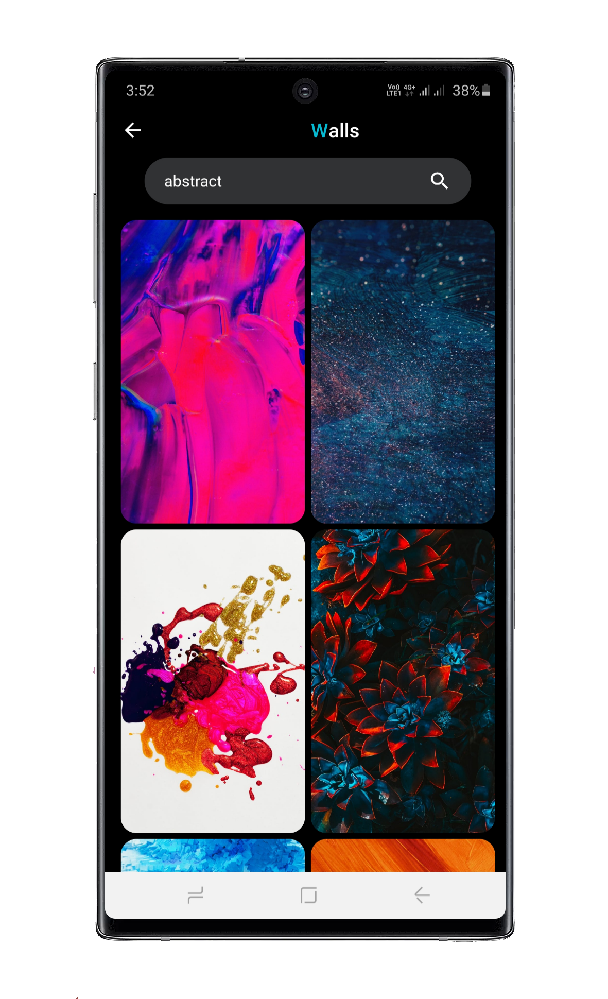

# walls    
Your phone wallpaper is great way to express your unique personality.
________________________________________________________________________________________________________________________________________
Walls is a wallpaper service app with out any Ads.

Beautiful, free photos.
Gifted by the world’s most generous community of photographers.

• Browse over 1,200,000+ HD photos
• New wallpapers everyweek
• Automatically refresh your home screen with a new random wallpaper every week
• black (AMOLED) theme built in
• Download raw photos

Walls - Free (do whatever you want) high-resolution photos.

## Getting Started

Walls was developed using Flutter for Android only in Android Studio with Pexels API.

It has a unique features like Feedback Collection and Push Notifications for users who installed on their devices.

    
    
    
    
    

